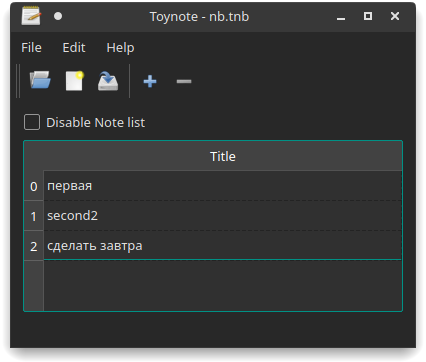

# Toynote
Toynote — простое графическое приложение для заметок, написанное с использованием библиотеки Qt. Является кроссплатформенным на уровне исходного кода.

[Кирилл Владимирович Пушкарёв](mailto:kpushkarev@sfu-kras.ru), 2019 г.
\
[Кашапов Ярослав Фанизович](mailto:ykashapov-ki19@stud.sfu-kras.ru), 2020 г.
